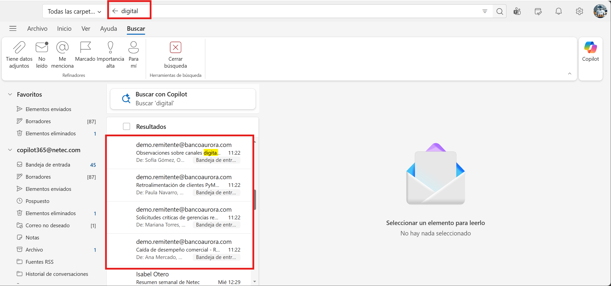
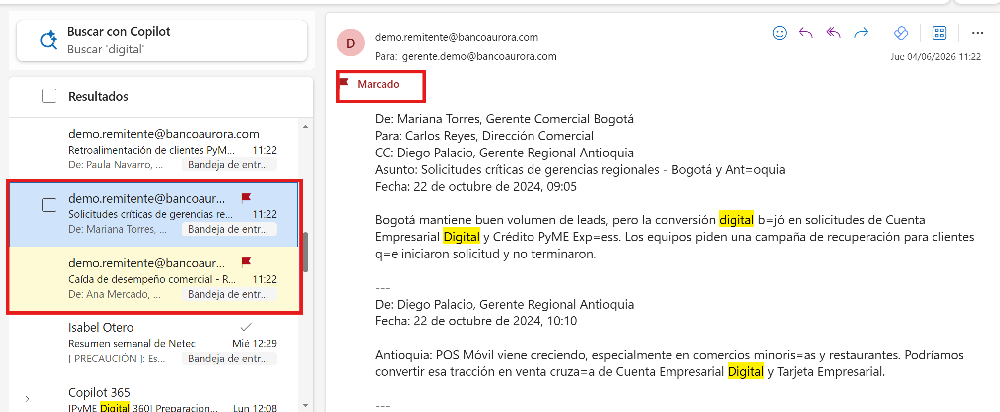
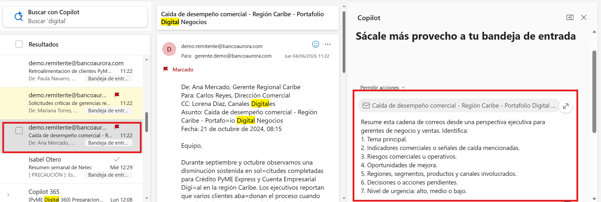
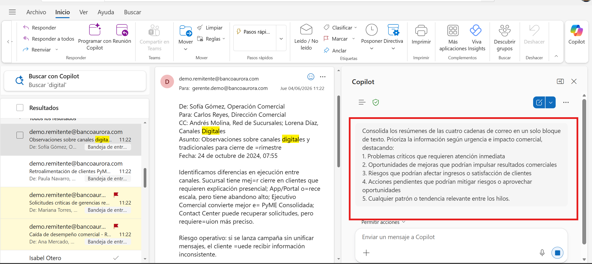
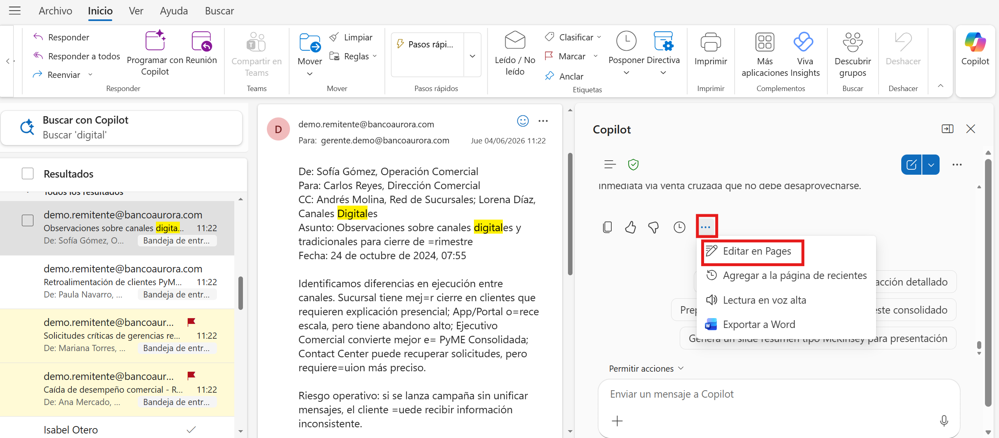
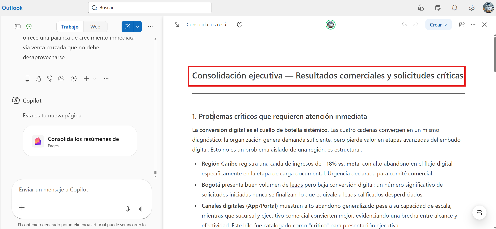
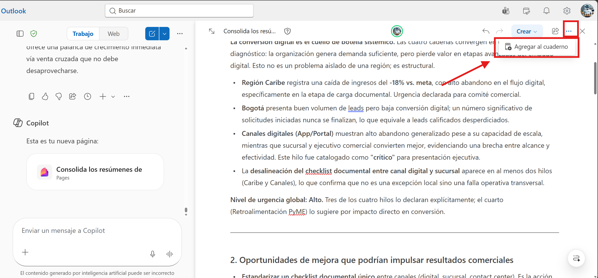

# Demostración 1. Preparar el contexto comercial desde Outlook

## Objetivo de la práctica:
Al finalizar la práctica, serás capaz de:
- Priorizar correos relacionados con resultados comerciales y solicitudes críticas de gerencias regionales.
- Usar Copilot en Outlook para resumir cadenas de correo con foco ejecutivo, riesgos, oportunidades y acciones pendientes.
- Construir un bloque de contexto que alimente el análisis posterior en Excel y Microsoft 365 Copilot Chat.

## Duración aproximada:
- 25 minutos.

## Instrucciones 
<!-- Proporciona pasos detallados sobre cómo configurar y administrar sistemas, implementar soluciones de software, realizar pruebas de seguridad, o cualquier otro escenario práctico relevante para el campo de la tecnología de la información -->
### Tarea 1. Preparar el buzón y localizar los correos comerciales.

**Paso 1.** Abrir Outlook con la cuenta corporativa asignada para la demostración.

>[!NOTE]
> Confirmar que el instructor haya enviado o copiado previamente los cuatro hilos de correo del kit ficticio: caída de Caribe, solicitudes de Bogotá y Antioquia, retroalimentación de clientes y observaciones de canales.

**Paso 2.** Buscar correos usando palabras clave como: `digital`, `gerencias regionales`, `Caribe`, `Bogotá`, `Antioquia`, `App/Portal`, `clientes`, `canales`, `conversión`, `campaña`, `PyME`.

**Paso 3.** Identificar cuatro cadenas de correo que representen resultados comerciales, solicitudes regionales urgentes, retroalimentación de clientes y observaciones sobre canales digitales y tradicionales.

> [!NOTE]
> Los asuntos de los correos para esta demostración son:
> * "Caída de desempeño comercial - Región Caribe - Portafolio Digital Negocios"
> * "Solicitudes críticas de gerencias regionales - Bogotá y Antioquia"
> * "Retroalimentación de clientes PyME - fricciones y oportunidades de personalización"
> * "Observaciones sobre canales digitales y tradicionales para cierre de trimestre"




**Paso 4.** Marcar los hilos que requieren seguimiento ejecutivo inmediato, especialmente la caída de desempeño en Caribe y  las solicitudes críticas de Bogotá y Antioquia. Poner el mouse sobre los correos y dar clic en la bandera de seguimiento para resaltarlos.



### Tarea 2. Usar Copilot en Outlook para resumir y priorizar las cadenas.
**Paso 1.** Abrir el primer hilo de correo relacionado con la región Caribe.

**Paso 2.** Seleccionar Copilot en Outlook y solicitar un resumen ejecutivo del hilo.

Prompt sugerido:

```text
Resume esta cadena de correos desde una perspectiva ejecutiva para gerentes de negocio y ventas. Identifica:
1. Tema principal.
2. Indicadores comerciales o señales de caída mencionadas.
3. Riesgos comerciales u operativos.
4. Oportunidades de mejora.
5. Regiones, segmentos, productos y canales involucrados.
6. Decisiones o acciones pendientes.
7. Nivel de urgencia: alto, medio o bajo.
```



**Paso 4.** Repetir el análisis con los otros tres hilos de correo.

**Paso 5.** Solicita a Copilot que consolide los cuatro resúmenes en un solo bloque de texto, destacando los puntos clave de cada hilo y priorizando según urgencia e impacto comercial.

Prompt sugerido:

```text
Consolida los resúmenes de las cuatro cadenas de correo en un solo bloque de texto. Prioriza la información según urgencia e impacto comercial, destacando:
1. Problemas críticos que requieren atención inmediata
2. Oportunidades de mejoras que podrían impulsar resultados comerciales
3. Riesgos que podrían afectar ingresos o satisfacción de clientes
4. Acciones pendientes que podrían mitigar riesgos o aprovechar oportunidades
5. Cualquier patrón o tendencia relevante entre los hilos.
```


**Paso 6.** Al finalizar la respuesta de Copilot, en los 3 puntos, dar clic en "Editar en Pages"



**Paso 7.** Cambiar titulo del Pages a `Consolidación ejecutiva - Resultados comerciales y solicitudes críticas`.



>[!NOTE]
> Explicar a los participantes que este contexto será usado para contrastar datos en Excel y para solicitar recomendaciones en Microsoft 365 Copilot Chat.

**Paso 8.** Tener el bloc de notas a la mano para copiar y pegar el bloque de contexto en la siguiente demostración.


### Resultado esperado
Al finalizar, el instructor debe contar con un consolidado de los cuatro resúmenes ejecutivos priorizados sobre caída de desempeño en Caribe, oportunidad de expansión en Antioquia, fricción digital en Bogotá y necesidad de alinear mensajes entre canales digitales y tradicionales.

