# Demostración 2. Analizar resultados comerciales en Excel y diseñar iniciativas con Microsoft 365 Copilot Chat

## Objetivo de la práctica:
Al finalizar la práctica, serás capaz de:
- Usar Copilot en Excel para analizar resultados comerciales por región, segmento, producto y canal.
- Identificar disminuciones de desempeño, brechas de meta y patrones en comentarios de clientes.
- Solicitar a Microsoft 365 Copilot Chat recomendaciones comerciales e iniciativas de hiperpersonalización.

## Duración aproximada:
- 35 minutos.

## Instrucciones 
<!-- Proporciona pasos detallados sobre cómo configurar y administrar sistemas, implementar soluciones de software, realizar pruebas de seguridad, o cualquier otro escenario práctico relevante para el campo de la tecnología de la información -->
### Tarea 1. Abrir el archivo comercial y revisar la estructura de datos.
**Paso 1.** Abrir Excel en el navegador o en la aplicación de escritorio.

**Paso 2.** Abrir el archivo `Resultados_Comerciales_Banca_Digital_2024.xlsx` desde OneDrive.

**Paso 3.** Revisar las hojas `Base_Comercial`, `Feedback_Clientes`, `Resumen_Ejecutivo` y `Guia_Copilot`.

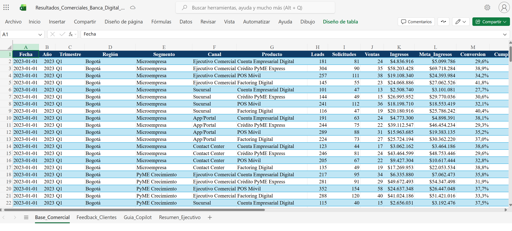

**Paso 4.** Activar Copilot en Excel desde la cinta de opciones.

>[!NOTE] 
>Explicar que los datos son ficticios y sirven para evaluar caídas de desempeño, oportunidades regionales y adopción de productos digitales.

### Tarea 2. Identificar caídas de desempeño por región, segmento y canal.
**Paso 1.** Solicitar a Copilot en Excel un análisis de las regiones con menor cumplimiento de meta.

```text
Analiza la tabla "Base_Comercial" e identifica las tres regiones con menor cumplimiento de meta durante 2024. Explica las posibles causas por canal, segmento y producto. Presenta el resultado en una tabla ejecutiva.
```
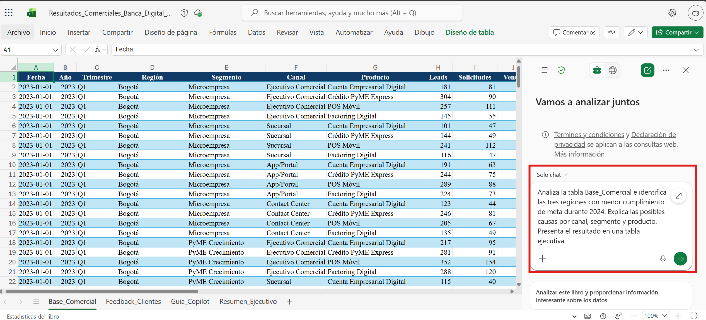

**Paso 2.** Solicitar una comparación específica entre Caribe, Bogotá y Antioquia.

```text
Compara el desempeño comercial de Caribe, Bogotá y Antioquia durante 2024. Identifica diferencias por ingresos, cumplimiento de meta, conversión, canal y producto. Resume los hallazgos para una gerencia comercial.
```
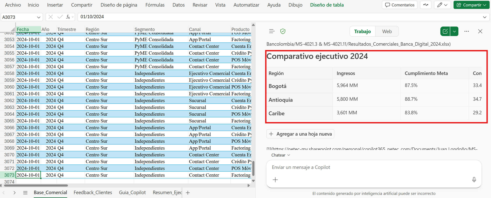

**Paso 3.** Pedir a Copilot que resalte filas críticas en la hoja `Base_Comercial` (Estar en el modo Edición).

```text
Resalta las filas donde el cumplimiento de meta sea menor a 85% y la alerta sea Crítico. Explica qué regiones, canales y productos se repiten con mayor frecuencia.
```
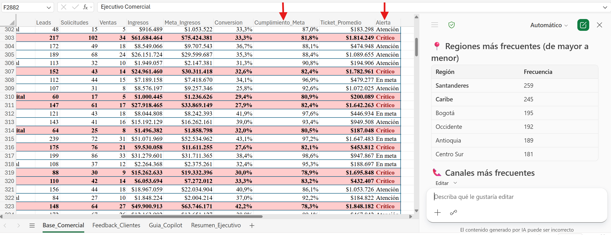

**Paso 4.** Solicitar una explicación en lenguaje natural sobre problemas de demanda, conversión digital y ejecución operativa.

Prompt sugerido:

```text
Explica en lenguaje natural las posibles causas de las caídas de desempeño comercial en las regiones identificadas. Considera factores como demanda, conversión digital, ejecución operativa, competencia y experiencia del cliente.
```
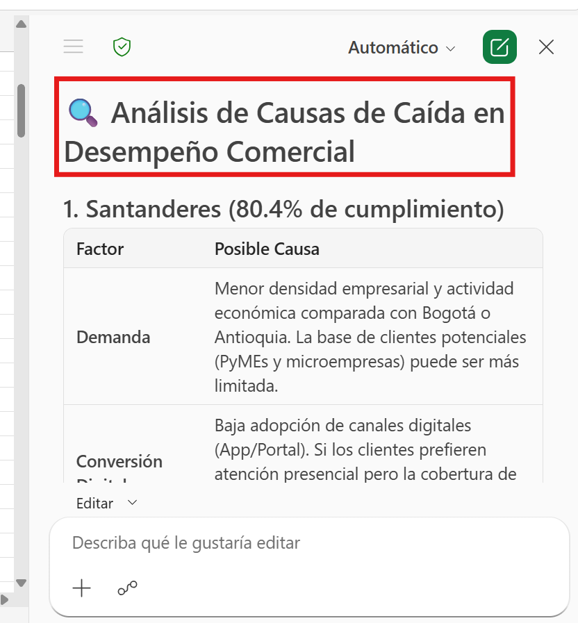

### Tarea 3. Analizar retroalimentación de clientes y oportunidades de hiperpersonalización.

**Paso 1.** Abrir la hoja `Feedback_Clientes`.

**Paso 2.** Solicitar a Copilot un resumen de los temas de clientes que afectan la conversión.

```text
Resume los 3 temas de clientes que más afectan la conversión comercial. Relaciona cada tema con región, canal, segmento y etapa del proceso.
```
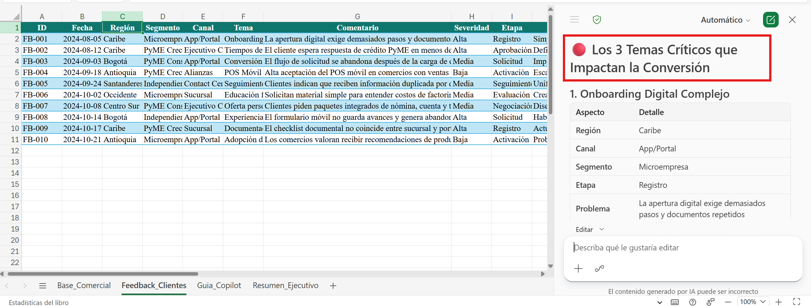

**Paso 3.** Pedir a Copilot que identifique oportunidades de hiperpersonalización por segmento.

```text
A partir de los comentarios de clientes y la base comercial, propone oportunidades de hiperpersonalización para Microempresa, PyME Crecimiento, PyME Consolidada e Independientes. Incluye canal recomendado, producto principal y mensaje comercial sugerido.
```
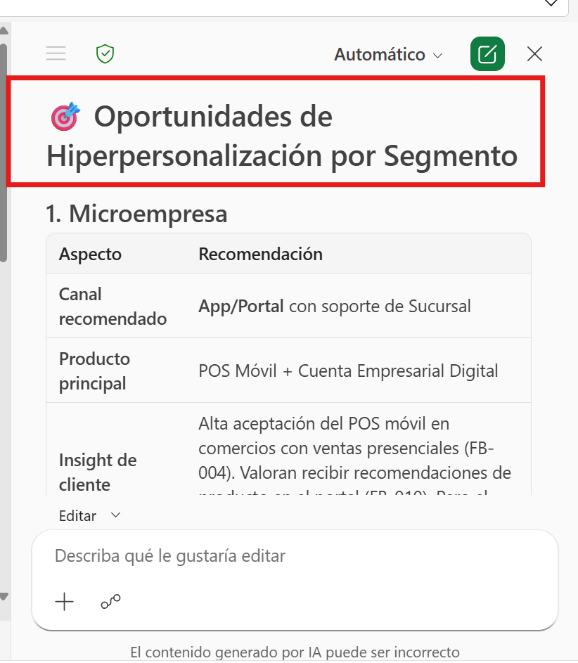

**Paso 4.** Solicitar a Copilot que consolide los hallazgos comerciales y de clientes.

```text
Consolida los hallazgos del análisis comercial y de feedback de clientes en un solo bloque de texto. Destaca las regiones, segmentos y canales con mayor oportunidad de mejora, y las recomendaciones de hiperpersonalización.
```
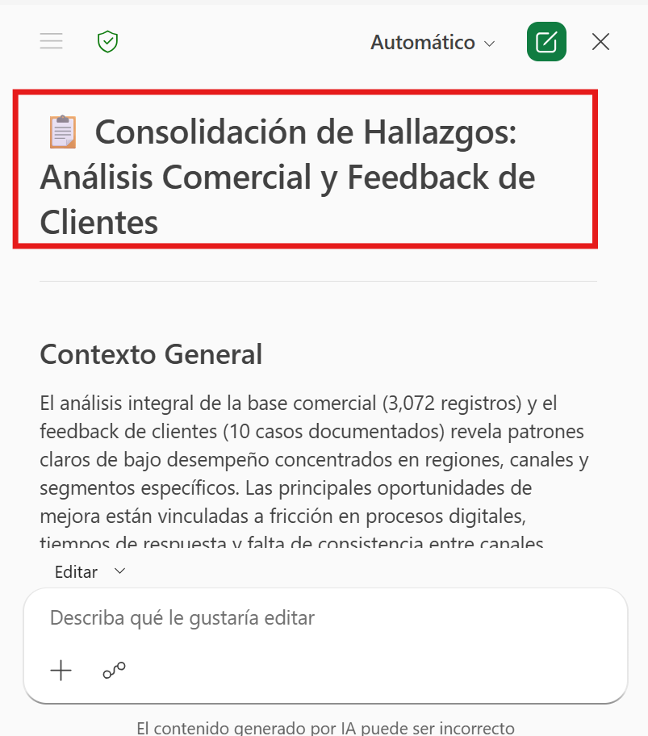

**Paso 5.** Copiar los hallazgos principales en el documento temporal que contiene los resúmenes de Outlook.

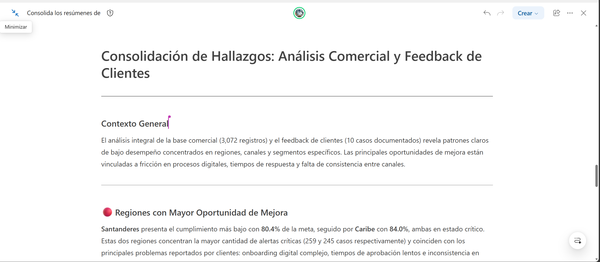

**Paso 6.** Solicitar a Copilot que genere un Dashboard ejecutivo con los indicadores clave.

```text
Crea un Dashboard en una hoja nueva ejecutivo con los indicadores clave de desempeño comercial, las regiones con mayor oportunidad, los temas de clientes más críticos y las recomendaciones de hiperpersonalización. Usa gráficos, tablas y texto para presentar la información de manera clara y visual.
```
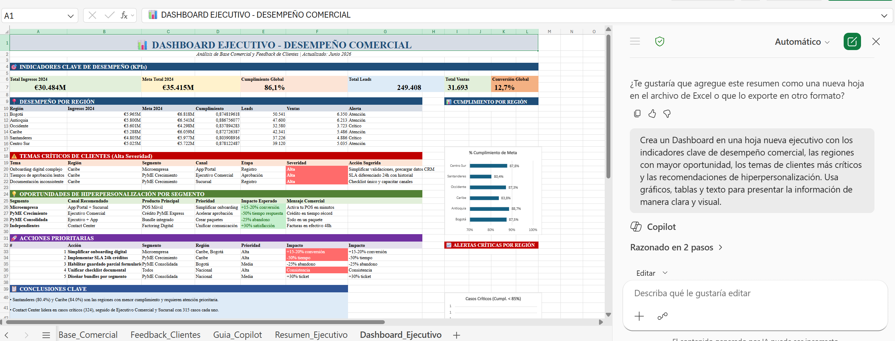

### Tarea 4. Usar Microsoft 365 Copilot Chat para convertir los hallazgos en iniciativas comerciales.
**Paso 1.** Abrir `m365.cloud.microsoft.com` o Microsoft 365 Copilot Chat.

**Paso 2.** Ingresar en Biblioteca y buscar la página generada en la primera demostración.

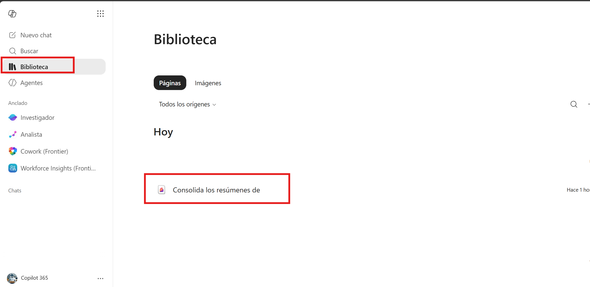

**Paso 3.** Abrir la página y trabajar con Copilot sobre ella.

**Paso 4.** Adjuntar o referenciar el archivo de Excel.

Prompt sugerido:

```text
Actúa como asesor de estrategia comercial para banca PyME. Con base en los hallazgos de Excel y los resúmenes de la página, genera una propuesta ejecutiva para gerentes de negocio y ventas. Incluye diagnóstico comercial por región y canal, segmentos con riesgo de caída, segmentos con potencial de crecimiento, cinco iniciativas comerciales priorizadas, estrategias de hiperpersonalización, acciones para mejorar adopción digital y recomendaciones para mejorar experiencia y conversión por canal.
```
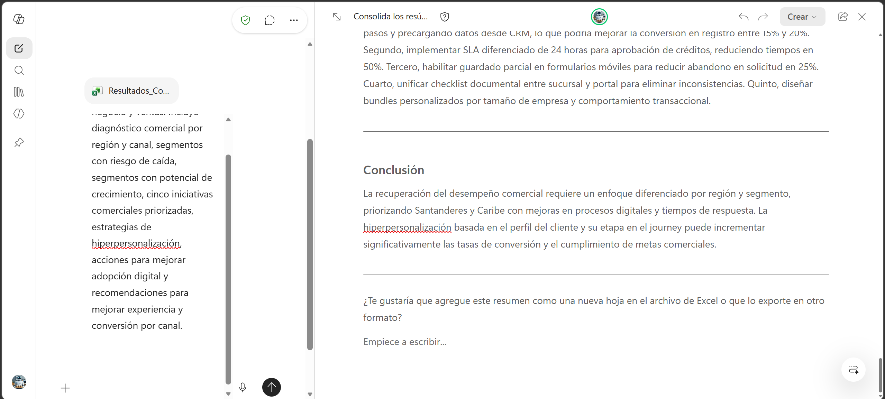

**Paso 5.** Solicitar una versión breve para dirección comercial.

```text
Convierte la propuesta anterior en un resumen ejecutivo de una página para dirección comercial. Usa lenguaje claro, orientado a decisiones y con próximos pasos.
```
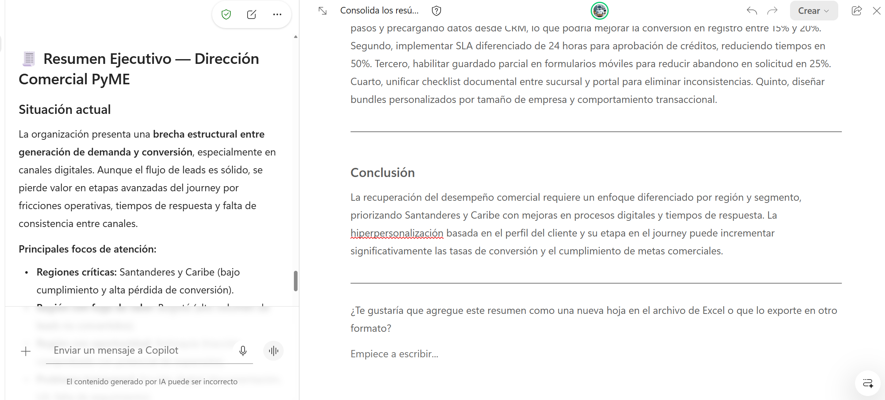

**Paso 6.** Solicitar a Copilot que sume la información a la página.

Prompt sugerido:

```text
Agrega esta propuesta comercial a la página. Crea un nuevo bloque de texto con el título "Propuesta comercial basada en análisis de Excel" y pega el resumen ejecutivo generado.
```
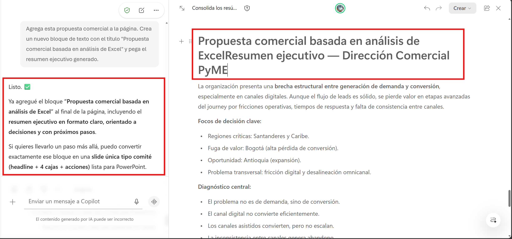

>[!NOTE]
> Explicar que esta propuesta se usará como insumo para la creación de la presentación ejecutiva en PowerPoint en la siguiente demostración.


### Resultado esperado

Al finalizar, el instructor debe contar con un análisis comercial estructurado que explique caídas por región, segmento y canal, y una propuesta de iniciativas comerciales orientadas a recuperación de desempeño, adopción digital e hiperpersonalización.

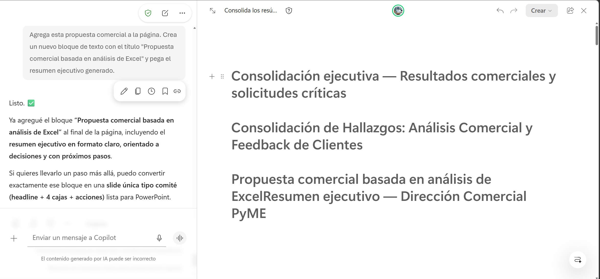