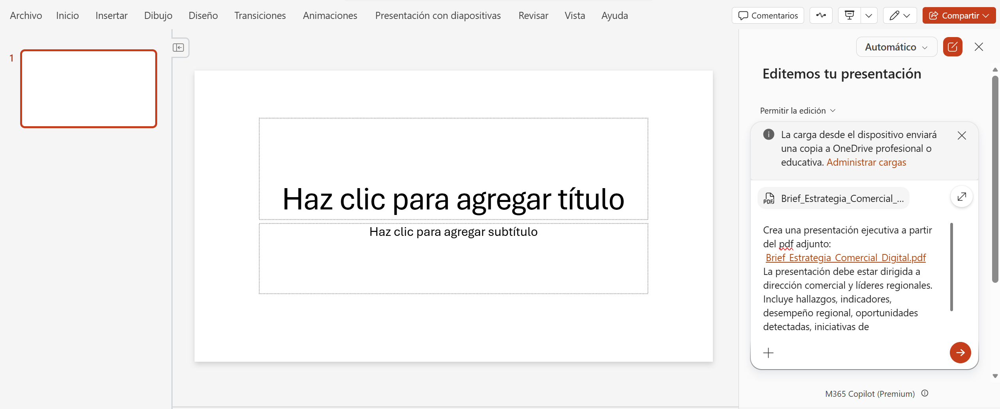
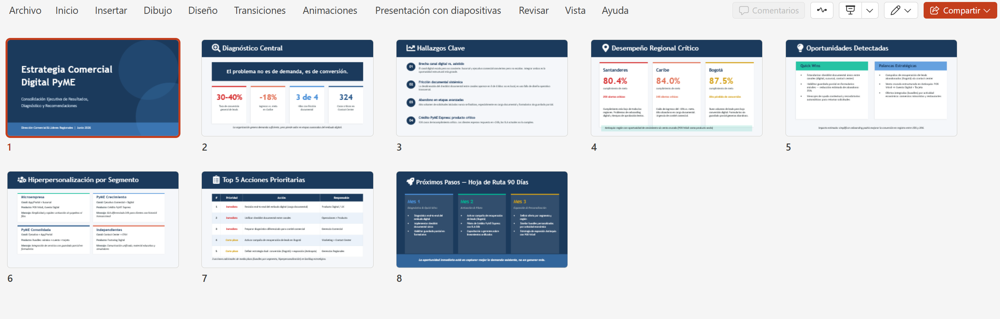
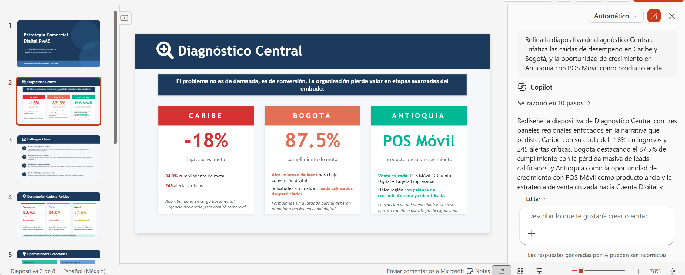
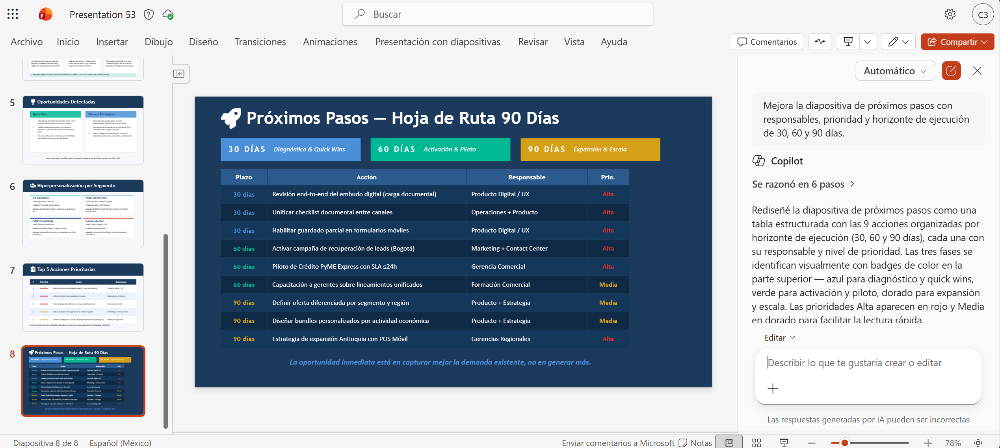
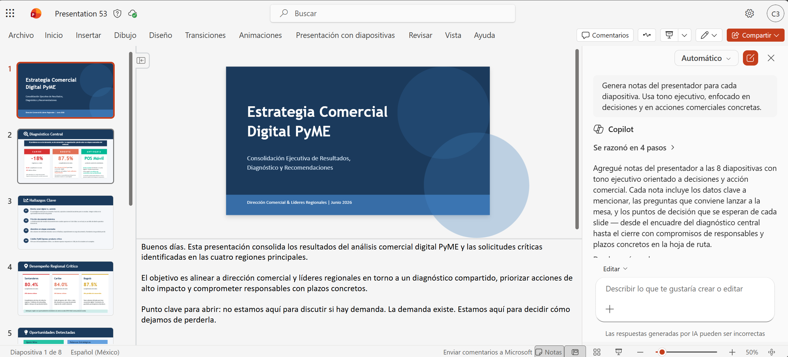
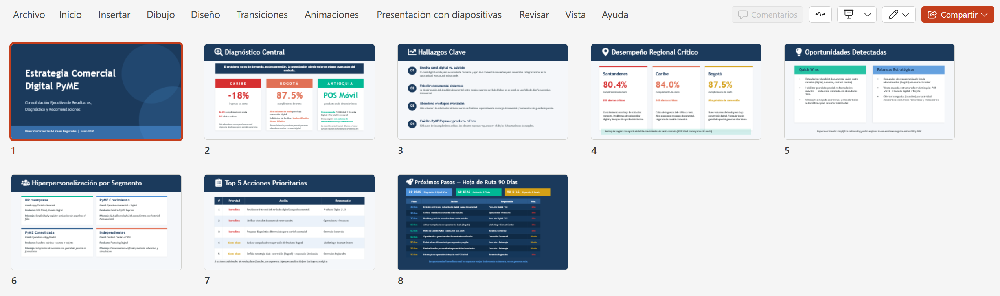

# Demostración 3. Crear una presentación ejecutiva con Copilot en PowerPoint

## Objetivo de la práctica:
Al finalizar la práctica, serás capaz de:
- Usar Copilot en PowerPoint para crear una presentación ejecutiva a partir de los hallazgos comerciales.
- Refinar diapositivas sobre indicadores, desempeño regional, oportunidades e iniciativas de hiperpersonalización.
- Preparar una narrativa de negocio para dirección comercial y líderes regionales.

## Duración aproximada:
- 25 minutos.

## Instrucciones 
<!-- Proporciona pasos detallados sobre cómo configurar y administrar sistemas, implementar soluciones de software, realizar pruebas de seguridad, o cualquier otro escenario práctico relevante para el campo de la tecnología de la información -->
### Tarea 1. Preparar el insumo para PowerPoint.
**Paso 1.** Confirmar que los resultados de Outlook, Excel y Microsoft 365 Copilot Chat estén consolidados.

**Paso 2.** Abrir la página consolidada desde M365 Copilot y crear PDF. Dar clic en el botón "Crear" y luego "PDF".

>[!NOTE] 
>El instructor puede utilizar el archivo "Brief_Estrategia_Comercial_Digital.pdf" para esta demostración, o crear un PDF desde el documento de Pages generado en la primera demostración.

**Paso 3.** Verificar que el documento incluya diagnóstico comercial, hallazgos por canal y segmento, riesgos, oportunidades, recomendaciones y próximos pasos.

### Tarea 2. Crear la presentación desde Copilot en PowerPoint.

**Paso 1.** Abrir PowerPoint en el navegador o en la aplicación de escritorio.

**Paso 2.** Crear una presentación en blanco.

**Paso 3.** Abrir el panel de Copilot.

**Paso 4.** Seleccionar la opción para crear una presentación desde un archivo o usar el siguiente prompt:

```text
Crea una presentación ejecutiva de 8 slides a partir del pdf adjunto: "[Nombre del Archivo]". La presentación debe estar dirigida a dirección comercial y líderes regionales. Incluye hallazgos, indicadores, desempeño regional, oportunidades detectadas, iniciativas de hiperpersonalización, recomendaciones estratégicas y próximos pasos.
```


>[!NOTE]
> Responder las preguntas que genera Copilot de acuerdo al contexto del curso.

**Paso 5.** Esperar a que Copilot genere el primer borrador de diapositivas.

**Paso 6.** Revisar la estructura propuesta y validar que incluya una narrativa ejecutiva clara.



### Tarea 3. Refinar las diapositivas clave.
**Paso 1.** Solicitar a Copilot que mejore la diapositiva de diagnóstico Central.

```text
Refina la diapositiva de diagnóstico Central. Enfatiza las caídas de desempeño en Caribe y Bogotá, y la oportunidad de crecimiento en Antioquia con POS Móvil como producto ancla.
```

**Paso 2.** Solicitar una diapositiva específica de hiperpersonalización.

```text
Agrega una diapositiva con estrategias de hiperpersonalización para Microempresa, PyME Crecimiento, PyME Consolidada e Independientes. Incluye canal recomendado, producto prioritario y mensaje comercial sugerido.
```


**Paso 3.** Solicitar una diapositiva de próximos pasos.

```text
Mejora la diapositiva de próximos pasos con responsables, prioridad y horizonte de ejecución de 30, 60 y 90 días.
```


**Paso 4.** Solicitar notas del presentador para el comité.

```text
Genera notas del presentador para cada diapositiva. Usa tono ejecutivo, enfocado en decisiones y en acciones comerciales concretas.
```



>[!NOTE]
> Explicar que el kit de marca corporativo no está cargado en este ambiente de demostración. Mencionar que, a nivel personal, desde el agente `crear`, se pueden cargar plantillas organizacionales y un kit de marca para uso individual, según disponibilidad del entorno. Indicar que el tutorial de uso de plantillas y kit de marca está publicado en el Canal de Early Adopters en Teams, si aplica al entorno del cliente.


### Resultado esperado
Al finalizar, el instructor debe tener una presentación ejecutiva con hallazgos comerciales, desempeño regional, oportunidades por canal, estrategias de hiperpersonalización y próximos pasos para dirección comercial.

